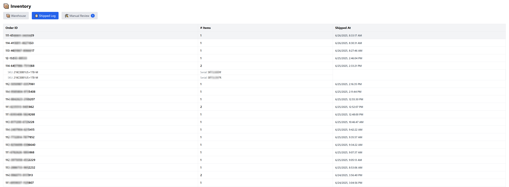

# Majool Inventory System

A full-stack inventory tracking system with real-time data sync, desktop scanning, and manual review workflows — built for fast-paced eCommerce and warehouse operations.

## Features

- 📦 Real-time inventory tracking across multiple platforms
- 🔄 Sync orders and product updates with external systems like Veeqo
- 🧾 Log every serial-numbered unit from delivery to sale
- 🖥️ Desktop app for scanning and assigning serial numbers
- 🧑‍💼 Web dashboard for admins to manage inventory, verify shipments, and run manual checks
- 🗃️ Local backups saved daily as CSV

If you're using a different fulfillment platform, you'll need to adjust the `/api/sync-veeqo-orders` route and any related data processing logic accordingly.

## Why I Built This

As part of managing inventory workflows for Majool Inc., I saw the need for a unified system that connected product data across mutliple online selling platforms, warehouse scanners, and order sync platforms. I designed this system to eliminate spreadsheet chaos, reduce inventory mismatches, and make life easier for warehouse and ops teams.

## 📦 Shipping Assumptions

This system assumes your orders are shipped through **Veeqo**.

The backend sync logic is built around the Veeqo API and powers several key features:

- ✅ Serial number assignment upon shipment
- 🧾 Inventory logging to `inventory_log`
- 🛠️ Flagging orders with missing serials or tracking info for manual review

## Tech Stack

| Layer           | Tech Used                     |
|----------------|-------------------------------|
| Backend API     | FastAPI, PostgreSQL, SQLAlchemy, Uvicorn |
| Frontend        | React, Vite, Tailwind CSS     |
| Desktop App     | Python, PyQt5, PyInstaller     |
| Dev Tools       | Git, dotenv, `.bat` scripts, NSSM, PyInstaller (EXE builds) |

## 🗃️ Database Schema

This system uses a normalized PostgreSQL schema to track products, inventory units, stock logs, users, and manual checks. Core tables:

### `categories`
| Column       | Type    | Description                  |
|--------------|---------|------------------------------|
| category_id  | SERIAL  | Primary key                  |
| name         | TEXT    | Unique category name         |

### `master_skus`
| Column         | Type      | Description                            |
|----------------|-----------|----------------------------------------|
| master_sku_id  | TEXT      | Primary key (no whitespace)            |
| description    | TEXT      | Description of SKU group               |
| created_at     | TIMESTAMP | Automatically set to `now()`           |

### `products`
| Column         | Type    | Description                              |
|----------------|---------|------------------------------------------|
| product_id     | SERIAL  | Primary key                              |
| master_sku_id  | TEXT    | FK to `master_skus`                      |
| part_number    | TEXT    | Unique part number                       |
| product_name   | TEXT    | Name of product                          |
| brand          | TEXT    | Manufacturer or brand                    |
| category_id    | INT     | FK to `categories`                       |

### `inventory_units`
| Column              | Type      | Description                                 |
|---------------------|-----------|---------------------------------------------|
| unit_id             | SERIAL    | Primary key                                 |
| product_id          | INT       | FK to `products`, cascades on delete        |
| serial_number       | TEXT      | Unique per unit                             |
| serial_assigned_at  | TIMESTAMP | Defaults to `now()`                         |
| assigned_by_user_id | INT       | FK to `users` (who scanned/assigned it)     |

### `inventory_log`
| Column        | Type      | Description                      |
|---------------|-----------|----------------------------------|
| log_id        | SERIAL    | Primary key                      |
| sku           | TEXT      | SKU involved in the event        |
| serial_number | TEXT      | Optional serial                  |
| order_id      | TEXT      | Related order ID                 |
| event_time    | TIMESTAMP | Defaults to `CURRENT_TIMESTAMP` |

### `manual_review`
| Column     | Type      | Description                            |
|------------|-----------|----------------------------------------|
| review_id  | SERIAL    | Primary key                            |
| order_id   | TEXT      | Order flagged for manual check         |
| sku        | TEXT      | SKU under review                       |
| created_at | TIMESTAMP | Defaults to `CURRENT_TIMESTAMP`        |

### `users`
| Column        | Type    | Description                        |
|---------------|---------|------------------------------------|
| user_id       | SERIAL  | Primary key                        |
| username      | TEXT    | Unique login                       |
| password_hash | TEXT    | Hashed password                    |
| is_admin      | BOOLEAN | Whether user has admin privileges  |

### 👁️ Views

- `view_master_sku_summary`: Aggregates master SKUs with product variant counts and total inventory units
- `view_product_stock_summary`: Supports frontend dashboard grouping; joins `products`, `categories`, `master_skus`, and `inventory_units` to display real-time stock by product

## Screenshots





## Deployment Notes
> ⚠️ **Important:** You must create three `.env` files before running the system. These are not included in the repo for security reasons.

### 1. Backend `.env` file — `inventory_backend/.env`

```env
DATABASE_URL=postgresql://<your_username>:<your_password>@<your_host>:5432/<your_database>
VEEQO_API_KEY=<your_veeqo_api_key>
VITE_API_HOST=http://<your_backend_ip>:8000
```

### 2. Scanner .env file — `inventory_scanner/.env`

```env
API_BASE_URL=http://<your_backend_ip>:8000/scanner
```

- The backend can be run as a Windows service using NSSM for persistent background execution.
- The desktop scanner app can be packaged as a portable `.exe` using PyInstaller — no Python install required.

- ### 2. Dashboard .env file — `inventory_dashboard/frontend/.env`

```env
VITE_API_HOST=http://<your_backend_ip>:8000
```

> ## Running It Locally

### 1. Backend API (FastAPI)

```bash
cd inventory_backend
python -m venv env
env\Scripts\activate
pip install -r requirements.txt
# Ensure .env file contains DATABASE_URL
uvicorn main:app --reload
```

### 2. Frontend Dashboard (React)

```bash
cd inventory_dashboard/frontend
npm install
npm run dev
```

### 3. Desktop Scanner App (PyQt5)

```bash
cd inventory_scanner
# Optional: activate env
start_main.bat
```

## Contact

Made by [George Patterson](https://github.com/georgepatterson2002)  
📫 Reach me for questions, freelance requests, or a walkthrough:

- 📧 Email: [georgelpatterson2002@gmail.com](mailto:georgelpatterson2002@gmail.com)  
- 🔗 LinkedIn: [linkedin.com/in/georgelpatterson](https://www.linkedin.com/in/georgelpatterson/)
